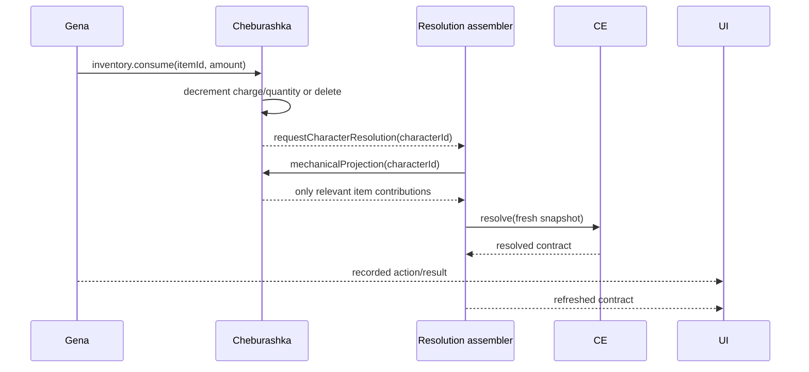

# Named Engine Contracts

> Status: **IN DEVELOPMENT — RUNTIME FOUNDATION ACTIVE ON `dev`**
>
> This is the operational companion to `ENGINE_ROADMAP.md`. Read both before
> changing gameplay commands, character resolution, inventory, entities, rolls,
> locations, world time, rests, preparation or chat action execution.

## One owner for every canonical fact

| Engine | Owns and persists | Does not own |
|---|---|---|
| **GENA** | session declarations/history, gameplay command routing, character resource ledger, rests, preparation, stored session choices/results, command correlation | inventory rows, entity identity, world topology, dice algorithms, CE calculations, scene rulings |
| **CE** | no canonical persistence; only deterministic calculation code and the transient resolved contract returned for one explicit input | inventory, characters, HP persistence, resources, chat, rolls, locations, time, commands |
| **CHEBURASHKA** | item instances, containers/holders, quantities, charges, equipment state, transfers, arbitrary item state and item mechanical definitions attached to instances | character identity, HP, world placement, scene rulings, resolved character totals |
| **SHAPOKLYAK** | PC/NPC existence, identity, type, assignment, visibility/discovery, lifecycle and canonical base character facts including explicit GM HP | inventory, locations/topology, dice, derived CE totals, session history |
| **LARISA** | locations/world hierarchy, links/maps, discoveries, character and scene placement, scene participants, descriptive campaign/scene/character chronology | character mechanics, resource recharge, effect expiry, inventory, HP, scene rulings |
| **TOBIK** | dice parsing/planning and one requested random resolution in memory | durable history, resources, HP, inventory, hit/miss decisions, scene legality |

`engine_command_receipts` is shared command infrastructure for idempotency, not
a UI-facing domain model. Tobik's durable result belongs to Gena's event/history;
Tobik itself does not become another result database.

## CE input ownership

CE stores nothing between calls. A character resolution assembler obtains fresh
projections from the owners and creates one `CharacterEngineInput`:

| Input part | Canonical owner | What CE receives |
|---|---|---|
| identity, level, base abilities, explicit HP | Shapoklyak | base/state projection needed for arithmetic |
| class resources, spell slots, stored choices, preparation | Gena runtime | explicit resource/state and authored contributions |
| equipment, item effects and item actions | Cheburashka | `InventoryMechanicalProjection.contributions`, never the backpack |
| locations and time | Larisa | nothing by default; only a future explicit mechanical projection if the product deliberately introduces one |
| dice result | Tobik through Gena | never part of canonical character storage merely because a roll happened |

A beer bottle with no mechanics stays only in Cheburashka. A protection ring can
produce an AC contribution. A grenade can produce an action while it exists. The
full rows, quantities, charges and item notes are never CE-owned state.

When a charged item reaches zero, Cheburashka's projection removes its use
actions/spells while preserving unrelated passive effects. CE therefore sees
exactly the capabilities it must calculate, not the charge ledger itself.

## Shared command envelope and result

Every cross-engine command uses an explicit context:

```ts
type EngineCommandContext = {
  commandId: string       // stable idempotency + correlation id
  campaignId: string
  requestedBy: string
  authority: "player" | "gm" | "system"
  occurredAt: string
  actorCharacterId?: string | null
  roomId?: string | null
}
```

An owning engine returns the mutated value plus durable/observable events and
explicit affected ids. A character-affecting owner directly requests a fresh
resolution after its commit. The request is an invalidation signal only; it does
not carry canonical rows and CE does not cache them.

```ts
type EngineCommandResult<T> = {
  value: T
  events: EngineEvent[]
  effects: {
    characterIds: string[]
    itemIds: string[]
    locationIds: string[]
    sceneIds: string[]
    resolveCharacterIds: string[]
  }
}
```

## Engine command and query surface

### Gena — central session orchestrator

Commands:

- `session.declare`
- `inventory.use`, `inventory.transfer` → Cheburashka
- `entity.reveal_npc`, `character.set_hp` → Shapoklyak
- `world.discover_location`, `world.move_character`
- `world.set_scene_position`, `world.set_scene_participants` → Larisa
- `world.sync_scene_participants` → Larisa
- `roll.request` → Tobik
- existing resource spend/recharge, rest, preparation and template action/spell commands

Abilities:

- accepts player/GM intentions;
- verifies command authority and coordinates multi-engine work;
- records what was declared and which owner changed state;
- keeps mutation and related chat history atomic where required;
- never substitutes its judgement for the GM's scene ruling.

### CE — pure character calculator

Queries:

- `resolveCharacterContract(input)`
- explanation/trace functions over that same explicit input/contract

Abilities:

- combines formulas, grants, suppressions, actions, resources and provenance;
- returns resolved stats/actions/spells/resources;
- performs no I/O, sends no commands and persists nothing.

### Cheburashka — inventory warehouse and porter

Commands:

- `inventory.create`, `inventory.update`, `inventory.remove`
- `inventory.set_equipped`
- `inventory.consume` — applies `none`, `quantity` or `charges` usage semantics
- `inventory.transfer`

Queries/projections:

- `getItem`, `listCharacterItems`
- `mechanicalProjection(characterId)`

Abilities:

- atomically changes the item aggregate it owns;
- emits item/inventory events;
- directly requests fresh CE resolution for every affected character;
- hides irrelevant warehouse data from CE.

### Shapoklyak — PC/NPC creation and storage

Commands:

- `entity.create`, `entity.update`, `entity.delete`
- `entity.set_active`, `entity.set_life_state`, `entity.set_visibility`
- `entity.reveal_npc`
- `entity.set_hp` — GM-authoritative only through Gena

Queries:

- `getEntity`, `listCampaignEntities`
- future explicit base-character projection for the resolution assembler

Abilities:

- owns who exists and their stable identity/lifecycle;
- validates PC/NPC and campaign relationships;
- signals character resolution when base mechanics/HP changed.

### Larisa — world, locations and descriptive time

Commands:

- `world.discover_location`
- `world.set_character_position`
- `world.set_scene_position`
- `world.set_scene_participants`
- `world.sync_scene_participants`

Queries:

- `loadCampaignSnapshot`

Abilities:

- owns where and when entities/scenes are recorded;
- stores discovery and chronology;
- does not trigger CE, rests, recharge, expiry, damage or NPC movement merely
  because time changed.

### Tobik — rolls

Commands/queries:

- `compileRollPlan(request)`
- `execute(request)` / `executeRollPlan(plan)`

Abilities:

- resolves d20 and arbitrary dice plans with structured output;
- returns the result to Gena for durable history;
- never applies the result to HP and never decides whether an attack hit.

## Communication rules

1. UI calls a command/query contract and renders returned/canonical state. It is
   never a message bus between engines.
2. Gena is the entry point for a play intention spanning history and another
   domain. The domain owner still performs its own mutation.
3. An engine never reads or writes another engine's tables. It uses that engine's
   command/query/projection contract.
4. After a character-affecting commit, the owning engine calls the resolution
   requester directly. The resolver fetches all fresh projections and calls CE.
5. CE never calls back, polls, publishes changes or owns the snapshot sources.
6. Commands that must be one gameplay fact share a transaction and `commandId`.
7. Raw UI realtime subscriptions are refresh fallbacks, not canonical engine
   communication. An engine-owned persistence adapter may translate its own
   committed table change into the same explicit resolution signal; this is how
   Cheburashka observes an atomic server-side Gena + inventory transaction.

## Canonical grenade sequence



If the grenade reaches zero, Cheburashka removes it. The next projection contains
no grenade action, so CE naturally stops returning that action. Gena did not
delete an inventory row; CE did not store or detect inventory drift; no sheet UI
transported the change.

## GM authority and HP

Damage/healing rolls are declarations/results only. Neither Gena nor Tobik nor CE
infers a target HP mutation. The canonical flow is explicit:

```text
GM command: character.set_hp
→ Gena verifies GM authority
→ Shapoklyak persists HP
→ Shapoklyak requests fresh character resolution
→ assembler fetches current owner projections
→ CE recalculates
```

The same principle applies to explicit GM NPC reveal, location discovery and
movement commands. Gena coordinates; Shapoklyak/Larisa own their facts; the GM
owns the scene truth.
